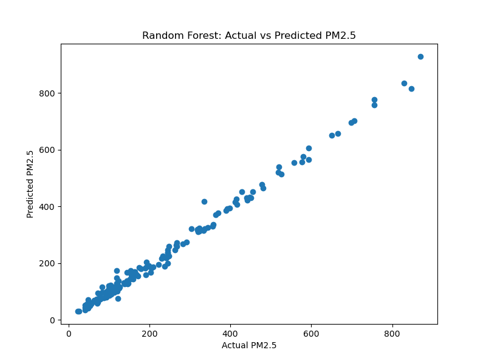
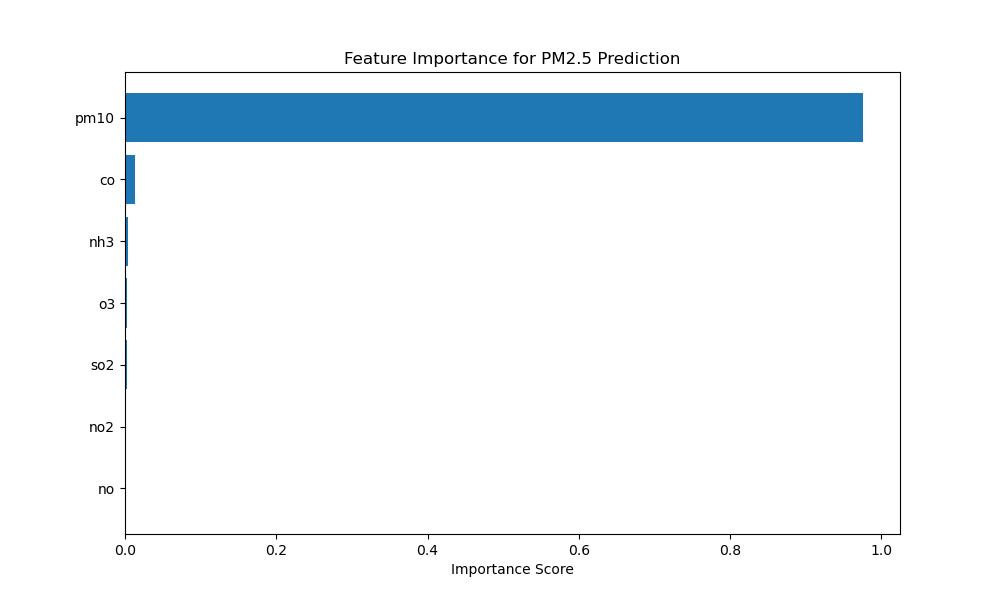

# Delhi Air Pollution Prediction

Machine learning project to predict **PM2.5 levels** using environmental and pollutant indicators.  
The objective is to understand pollution dynamics and demonstrate how predictive analytics can support environmental health monitoring.

---

## Clinical Intelligence Context

Air pollution is strongly associated with respiratory diseases such as **asthma, COPD, and cardiovascular complications**.

This project demonstrates how machine learning models can analyze environmental pollution patterns and generate insights relevant to **public health and environmental health monitoring**.

Predictive modeling of PM2.5 can support researchers, policy analysts, and healthcare systems in understanding pollution trends that affect population health.

---

## Project Architecture

The project follows a structured machine learning workflow.

1. **Data Collection**
   - Delhi air pollution dataset containing meteorological and pollutant indicators

2. **Data Cleaning & Preprocessing**
   - Handling missing values
   - Removing inconsistencies
   - Preparing data for modeling

3. **Feature Engineering**
   - Selecting relevant environmental and pollutant variables
   - Creating features useful for PM2.5 prediction

4. **Model Development**
   - Linear Regression
   - Decision Tree Regressor
   - Random Forest Regressor

5. **Model Evaluation**
   - Comparing predicted vs actual PM2.5 values
   - Calculating regression performance metrics

6. **Model Interpretation**
   - Feature importance analysis to identify dominant pollution drivers

---

## Model Performance

Three regression models were evaluated for predicting PM2.5 levels.

- Linear Regression
- Decision Tree Regressor
- Random Forest Regressor

**Best Model: Random Forest**

Evaluation Metrics:

RMSE: **17.05**  
MAE: **11.95**  
R² Score: **0.99**

These results indicate that the model captures most of the variance in PM2.5 levels and can effectively model nonlinear relationships between environmental variables.

---

## Public Health Insight

Feature importance analysis shows that particulate indicators such as **PM10** strongly influence PM2.5 levels.

Gaseous pollutants like **NO₂** and **SO₂** contribute secondary signals.

This suggests that **particulate emissions remain a dominant driver of urban air quality deterioration**, which is strongly linked to respiratory health risks.

Understanding these patterns can help guide **air quality monitoring and public health policy**.

---

## Visual Insights

### Prediction vs Actual PM2.5



This visualization compares predicted PM2.5 values from the Random Forest model with actual observed values.

---

### Feature Importance



Feature importance analysis highlights which environmental variables contribute most strongly to PM2.5 prediction.

---

## Project Structure

```
delhi-air-pollution-prediction
│
├── data
│   ├── raw
│   └── processed
│
├── figures
│   ├── prediction_vs_actual.png
│   └── feature_importance.png
│
├── models
│   └── pm25_random_forest.pkl
│
├── notebooks
│   ├── 01_data_cleaning_and_eda.ipynb
│   ├── 02_feature_engineering.ipynb
│   └── 03_modeling_pm25_prediction.ipynb
│
├── src
│
├── README.md
└── requirements.txt
```

---

## Technologies Used

Python  
Pandas  
NumPy  
Scikit-learn  
Matplotlib  

---

## Future Work

Possible extensions of this project include:

- Integrating hospital respiratory admission data
- Building real-time pollution prediction systems
- Developing environmental health dashboards
- Applying deep learning models for time-series forecasting

---